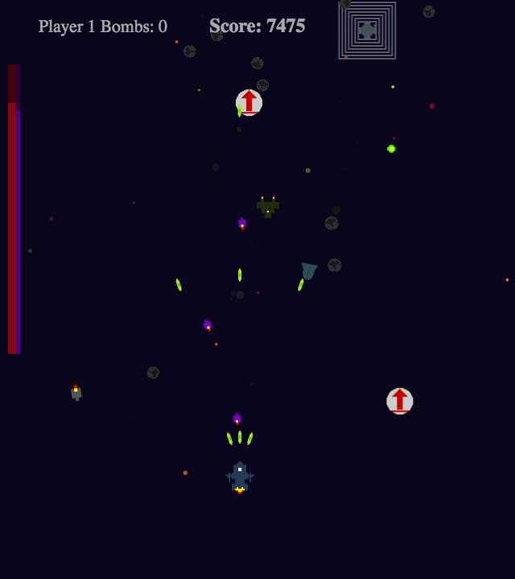

#Space Defender

Space Defender is a 2D top-down shooter where the only objective is to survive against an onslaught of enemies and rack up as many points as possible. It's built primarily using HTML5 Canvas, JavaScript, and a little React.js for the UI components.

Play live at: [Space Defender](http://trashctor.github.io/Space-Defender/)

##Instructions:

- Hold down the fire button to shoot continuously.
- Enemy projectiles (and player ones too) can all be destroyed.
- Game gets progressively harder.
- Four enemy types in total.
- Players can carry up to three bombs with a short cooldown on each use.
- Red power ups provide a little health. 

- White power ups give the player a bomb. 

- Purple power ups upgrade weapons for 7.5 seconds. 

####Player 1 Controls:

* Fire: \`
* Bomb: 1
* Up: w or t
* Left: a or f
* Down: s or g
* Right: d or h

####Player 2 Controls:

* Fire: ]
* Bomb: \
* Up: Numpad 8 or 8
* Left: Numpad 4 or 4
* Down: Numpad 5 or 5
* Right: Numpad 6 or 6

##Technical Details:

* Uses circles drawn via Canvas to create particle effects with the ability to fade and shrink over lifetime. Values like color, speed, distance to travel, and radii can be randomly selected based on a provided range to give the intended graphical effect.

* Missiles determine closest valid target and change their angle to hit it, while keeping the same speed.

* Collision is handled using AABBs and circles, based on the sprite in question. Sprites are also rotated according to their angle value and stretched to match their collision box; this is especially useful for asteroids that split and become smaller.

##Features:

* Single or multiplayer modes.
* Three different power ups and four enemies in total.
* Explosions and on-hit particle effects.
* Enemy types grow stronger and spawn more quickly as time go on.
